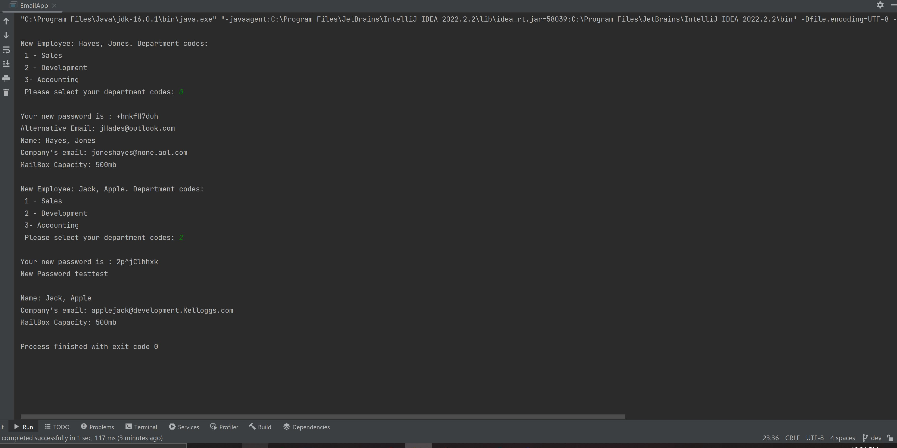

# Email Administration

<h1>Scenario: You are an IT Support Administrator Specialist and are charged with the task of creating email accounts for a new hire. </h1>

Application's features: 

<ul>
    <li>Generate email: firstName.lastName@department.company.com</li>
    <li>Determine department: sale, development, accounting, or none(leave blank)</li>
    <li>Generate random password</li>
    <li>Methods: changePassword, mailBox Capacity, alternative email</li>
    <li>Display employee's info: name, email, and mailbox capacity</li>
</ul>
 
